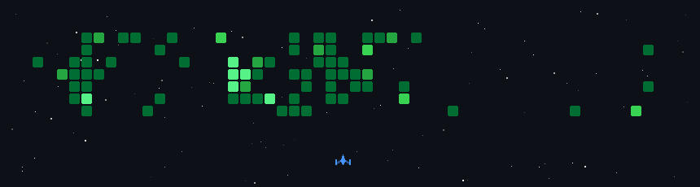

```go


package main

import "fmt"

type Explorer struct {
	Name            string
	Role            string
	LanguageSpoken  []string
	Learning        string
	FunFact         string
}

func (e *Explorer) SayHi() {
	fmt.Println("Thanks for dropping by, hope you find some of my work interesting.")
}

func main() {
	me := Explorer{
		Name:           "Gaurav Singh",
		Role:           "Backend developer in Go and Nodejs",
		LanguageSpoken: []string{"hn_In", "en_US"},
		Learning:       "Server security",
		FunFact:        "I'm a Stoic",
	}

	me.SayHi()
}

```
[](https://github.com/ellerbrock/open-source-badge/)


## 🌐 Socials:
[](https://discord.gg/euclid#3137) [](https://instagram.com/Euclid.stellar) [](https://www.linkedin.com/in/gaurav-singh-🚀-637686213/) [](https://medium.com/@euclidstellar_57634) [](https://twitter.com/euclidstellar) 
 [](https://euclidstellar.vercel.app) 

# 💻 Tech Stack:
         

[](https://medium.com/@euclidstellar_57634)


# 📊 Leetcode Stats:


<!---

 <br>

-->


<!-- ha bhai kya dekh rha hai inspiration ki rating lagai hai ek din yahi pe hunga samay de thora  
-->
## 📐 Activity Graph
<!-- Copy-paste in your Readme.md file -->

<a href="https://next.ossinsight.io/widgets/official/compose-user-dashboard-stats?user_id=100860877" target="_blank" style="display: block" align="center">
  <picture>
    <source media="(prefers-color-scheme: dark)" srcset="https://next.ossinsight.io/widgets/official/compose-user-dashboard-stats/thumbnail.png?user_id=100860877&image_size=auto&color_scheme=dark" width="771" height="auto">
    
  </picture>
</a>

<!-- Made with [OSS Insight](https://ossinsight.io/) -->


---
[](https://visitcount.itsvg.in)

